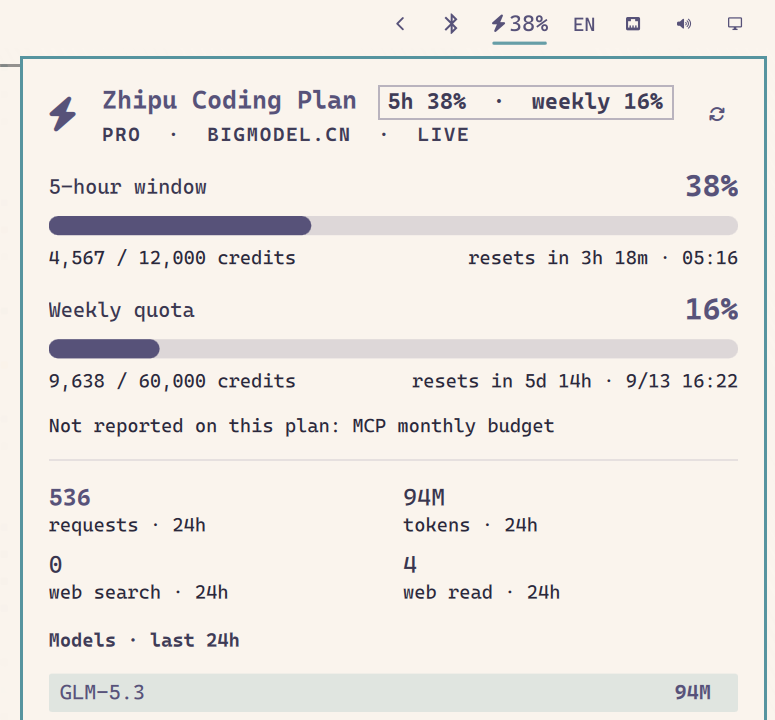

# Zhipu Coding Usage

Zhipu GLM Coding Plan usage as one glyph on the Omarchy bar and one panel
behind it — the 5-hour window, the weekly quota, and the monthly MCP tool
budget, for accounts on **open.bigmodel.cn** (default) or **api.z.ai**.



## What it shows

- **5-hour window** — percent used, credits used / budget, reset countdown
  **and** the absolute wall-clock time the window rolls over.
- **Weekly quota** — same, for the week. Old plans without a weekly quota get
  a "not reported on this plan" note instead of a fake zero.
- **MCP monthly** — the `TIME_LIMIT` tool budget with per-tool detail
  (search-prime · web-reader · zread), when the plan reports one.
- **Last 24 hours** — requests and tokens totals, per-model token ranking,
  and web search / web read tool counts.
- **Threshold notifications** — a desktop notification the first time the
  weekly or MCP-monthly window crosses 75 / 90 / 100 %, and at 90 % for the
  5-hour window (once per reset cycle each).
- **Staleness honesty** — on network failure the panel keeps the last good
  numbers, says "stale", and shows their age.

The bar glyph shifts toward the theme's urgent color as the 5-hour window
fills, so a hot session is visible without opening anything.

## Install

```sh
omarchy plugin add https://github.com/Aniakea/zhipu-coding-usage --enable
```

That clones the plugin to `~/.config/omarchy/plugins/`, rescans, and places
the widget on the bar. To place it yourself:

```sh
omarchy plugin enable io.github.aniakea.zhipu-coding-usage --section right
omarchy bar move io.github.aniakea.zhipu-coding-usage --section center
```

## Requirements

- Omarchy 4.x with `omarchy-shell` (Quickshell).
- Python 3.10+ (ships with Arch; standard library only — no pip packages).
- A Zhipu / z.ai Coding Plan API key (see below).
- `notify-send` (libnotify) for notifications — optional; without it the
  panel works and notifications are skipped.

## Where the key comes from

Tried in this order — first hit wins:

1. `ZHIPUAI_API_KEY`, `ZAI_API_KEY`, or `GLM_API_KEY` in the environment
2. `"apiKey"` in `~/.config/omarchy/zhipu-coding-usage.json`

Nothing else is read at runtime — no third-party credential stores. Two
one-time setup commands write the config file (mode 0600):

```sh
PLUGIN_BIN=~/.config/omarchy/plugins/io.github.aniakea.zhipu-coding-usage/bin/zhipu-coding-usage

# Set a key directly (omit the value to be prompted silently):
$PLUGIN_BIN --set-key <KEY>

# Or migrate the key you already gave OpenCode, once and explicitly:
$PLUGIN_BIN --import-key
```

`--import-key` copies from `~/.local/share/opencode/auth.json` into the
plugin's own config and never reads it again. Both accept `--region cn|intl`
to pin the region (default `cn`; keys from the two regions are **not**
interchangeable).

The full config shape:

```json
{
  "apiKey": "…",
  "region": "cn",
  "notify": true,
  "organization": null,
  "project": null
}
```

`organization` / `project` are sent as `bigmodel-organization` /
`bigmodel-project` headers for team plans. Set `"notify": false` to silence
notifications. The key is used for the API requests only — never written to
the state record, the notify state, or any log.

## What it talks to

Two hosts, nothing else, GET only:

| Region | Base | Endpoints |
| --- | --- | --- |
| `cn` (default) | `https://open.bigmodel.cn` | `/api/monitor/usage/quota/limit` · `/api/monitor/usage/model-usage` · `/api/monitor/usage/tool-usage` |
| `intl` | `https://api.z.ai` | same paths |

These are the same monitor endpoints the Zhipu web dashboards use. They are
unofficial and undocumented; if they change, the panel says so instead of
lying with stale-looking-fresh numbers. There is no telemetry and no other
network access.

## Widget settings

Set with `omarchy bar set`, or the widget's entry in
`~/.config/omarchy/shell.json`:

| Key | Default | What it does |
| --- | --- | --- |
| `refreshIntervalSec` | `120` | Collector cadence |
| `barDisplay` | `"percent"` | Bar label: `percent` (5 h), `weekly`, `both`, or `icon` |
| `glyph` | ⚡ | Override the bar glyph if your font lacks the default |

```sh
omarchy bar set io.github.aniakea.zhipu-coding-usage barDisplay both
omarchy bar set io.github.aniakea.zhipu-coding-usage refreshIntervalSec 600 --json
```

Numbers need `--json`, or they land in `shell.json` as strings.

## Interactions

| Where | Action |
| --- | --- |
| Bar glyph | left = panel · right = refresh · middle = cycle the bar label |
| Panel | `j`/`k` scroll · `r` or Enter refresh · `b` open the usage page · Tab to the neighboring panel · Esc close |

## IPC

```
omarchy-shell zhipu open
omarchy-shell zhipu close
omarchy-shell zhipu toggle
omarchy-shell zhipu refresh
omarchy-shell zhipu usage     # prints "Pro: 5h 6% · weekly 9%"
```

## How it works

`bin/zhipu-coding-usage` (Python, stdlib only) fetches the quota windows and
the 24 h usage series, parses the plan's protocol variant (credit-limit rows
with `unit`/`number` discriminators, token-limit rows sorted by reset time,
`TIME_LIMIT` MCP budget, legacy flat fields), and writes one JSON record
atomically to `~/.local/state/omarchy/zhipu/usage.json`. `Panel.qml` watches
that file and draws whatever it says — it owns no arithmetic of its own.

Run the collector yourself to see what the panel sees:

```sh
~/.config/omarchy/plugins/io.github.aniakea.zhipu-coding-usage/bin/zhipu-coding-usage --print
```

## Remove

```sh
omarchy plugin disable io.github.aniakea.zhipu-coding-usage
omarchy plugin remove io.github.aniakea.zhipu-coding-usage
```

Neither touches OpenCode's own data. The records this plugin writes live in
`~/.local/state/omarchy/zhipu/` and can be deleted by hand:

```sh
rm -rf ~/.local/state/omarchy/zhipu
```

## Development

The design decisions live in `docs/adr/`, the vocabulary in
`docs/glossary.md`. Tests cover the protocol parsers:

```sh
uv run --with pytest pytest -q
```

## License

MIT — see LICENSE.
